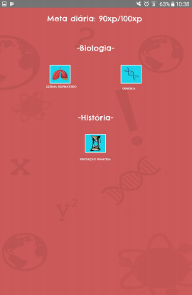

# SimulaVest
 A aplicação “SimulaVest” é um projeto de TCC que objetiva atender a parcela de alunos que prestarão vestibulares por todo o país, proporcionando um meio alternativo de estudos, baseando-se em um jogo que realiza disputas entre os vestibulandos, onde o ganhador é aquele que acerta a maior quantidade de perguntas. Além disso, a aplicação fornece outros modos, no qual o jogador pode estudar sozinho - com o auxílio de um cronograma. Desta forma, o jogo se diferencia das outras opções de mercado devido ao seu caráter voltado integralmente às provas de vestibular e o estudo do estudante que antecede esses exames. O SimulaVest foi desenvolvido nativamente para a plataforma Android através da linguagem java e do banco de dados em nuvem do serviço Firebase da Google, o Real Time Database.
 

